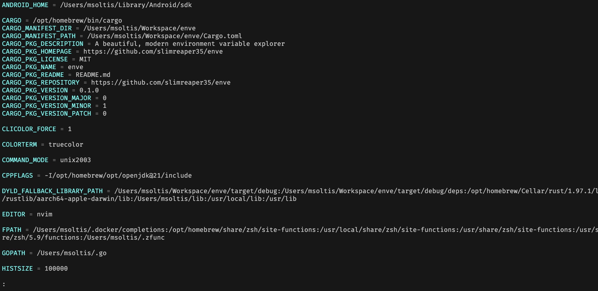

# bnv

A beautiful, modern environment variable explorer

[](https://crates.io/crates/bnv)
[](https://crates.io/crates/bnv)
[](https://github.com/slimreaper35/bnv/blob/main/LICENSE)
[](https://docs.rs/bnv/latest/bnv)



## Installation

### macOS

```bash
brew install slimreaper35/bnv/bnv
```

### Cargo

```shell
cargo install bnv
```

## Usage

List all environment variables:

```shell
bnv
```

Print a single variable:

```shell
bnv PATH
```

Filter by name with a regex:

```shell
bnv --grep '^AWS_'
```
